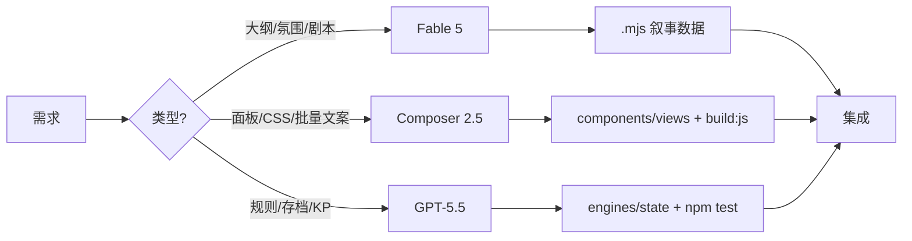

# Cursor 多模型开发工作流（CoC Engine）

本文档定义 **开发时** 在 Cursor 中如何选择 AI 模型与 Task 子代理。  
**不包含** 游戏内运行时 LLM（`js/ai/network.mjs` 的 DeepSeek API）——那是玩家对话/KP 推理链路，与本文无关。

---

## 1. 三模型分工

| 模型 | Cursor slug | 主要职责 |
|------|-------------|----------|
| **Fable 5** | `claude-fable-5-thinking-high` | 模组大纲、洛夫克拉夫特式场景、美术/氛围方向、叙事与 KP 口吻设计 |
| **Composer 2.5 Fast** | `composer-2.5-fast` | 编辑器内 UI 代码、大批量对话/文案录入、机械式组件拼装 |
| **GPT-5.5** | `gpt-5.5-medium` | 硬核系统：理智、检定、存档结构、规则引擎、持久化、KP 执行逻辑 |

系统当前可用的 Task 子代理模型 slug **仅限以上三个**。

---

## 2. 目录归属（谁改哪块）

### Fable 5 — 叙事与战役内容

| 路径 | 说明 |
|------|------|
| `js/data/scenarios/**` | 内置/可下载剧本（`.mjs` 权威源） |
| `js/data/campaigns/**` | 战役目录、KP 规则文案、反派/语言校正等 |
| `js/data/ai_prompt_config.mjs` | 难度预设、KP 提示词模板（叙事向） |
| `docs/archive/CCGS*` | 创意/UX 审查类文档 |

典型任务：新模组梗概、场景节拍、NPC 人设与台词风格、克苏鲁氛围描写、战役分支设计。

### Composer 2.5 Fast — UI 与批量录入

| 路径 | 说明 |
|------|------|
| `js/components/**` | Vue 面板（聊天、战斗、地图、角色等） |
| `js/views/**` | 大厅、Creator、Story 等视图壳层 |
| `css/style.css` | 设计令牌与样式（配合 `docs/UI_DESIGN.md`） |
| `index.html` | 静态壳与脚本加载顺序 |
| `icons/**` | PWA / 精灵图资源 |

典型任务：新面板布局、无障碍焦点环、空状态文案批量粘贴、表单字段、Bootstrap 网格内改 DOM 结构。  
UI 大改前先读 `docs/UI_SKILL_WORKFLOW.md` 与 `docs/UI_DESIGN.md`。

### GPT-5.5 — 引擎与状态

| 路径 | 说明 |
|------|------|
| `js/engines/**` | 理智、骰子、战斗、技能、神话等规则引擎 |
| `js/state/**` | `CoCState`、存档、迁移、`kp_config` |
| `js/campaign/kp_*.mjs` | KP 执行引擎、游戏循环 |
| `js/tools/**` | AI 工具定义与 Handler（游戏内工具协议，非 Cursor） |
| `js/scenario/store.mjs`, `js/scenario/runner.mjs` | 剧本存储与运行器 |
| `tests/**` | Smoke 与引擎回归测试 |

典型任务：理智结算边界、检定成功率、存档版本迁移、`KpExecutionEngine` 行为、工具 Handler 副作用。

### 不归本工作流管辖

| 路径 | 说明 |
|------|------|
| `js/ai/network.mjs` | 运行时 DeepSeek 请求——**不要**为「换 Cursor 模型」而改此文件 |
| `js/ai/worker*.js`, `js/ai_logic.mjs` | 运行时 AI 编排 |

---

## 3. 何时升级到更强模型

在 Agent 对话中若发现当前模型「力有不逮」，按 **问题本质** 换模型，而非盲目用最贵模型：

| 现象 | 升级到 |
|------|--------|
| 剧情平淡、神话感不足、KP 口吻不对 | Fable 5 |
| 组件能跑但布局/a11y/令牌不一致 | Composer 2.5（并引用 UI 文档） |
| 规则算错、存档坏档、KP 逻辑与状态不一致 | GPT-5.5 |
| 单次改动跨叙事 + UI + 引擎 | **拆分任务**：各开一个 Task 子代理，分别指定 `model` |

---

## 4. 在 Cursor 中如何调用

### 4.1 主 Agent（当前对话）

- 在聊天里 **写明模型倾向**，例如：「这段只改 `story_combat.mjs` UI，用 Composer 风格，遵循 `UI_DESIGN.md`」。
- 项目已启用规则 `.cursor/rules/ai-model-routing.mdc`（`alwaysApply: true`），Agent 会按路径与任务类型自动倾向对应模型。

### 4.2 Task 子代理（显式 `model`）

父 Agent 可通过 Task 工具 spawn 子代理，并传入 **精确 slug**：

```
model: "claude-fable-5-thinking-high"   # Fable 5
model: "composer-2.5-fast"              # Composer 2.5 Fast
model: "gpt-5.5-medium"                  # GPT-5.5
```

**适用场景：**

1. **大范围并行**：例如 Fable 写场景大纲的同时，Composer 改大厅卡片，GPT-5.5 修 `sanity.mjs`。
2. **只读脑暴**：`readonly: true` + Fable 5，输出大纲不落盘，再由你或 Composer 录入。
3. **隔离风险**：引擎改动与 UI 改动分两个子代理，避免一次 diff 搅在一起。

### 4.3 用户侧提示词模板

**叙事：**

> 用 Fable 5 思维：为 `js/data/scenarios/xxx.mjs` 写第三幕场景大纲，洛夫克拉夫特式慢热恐惧，输出中文节拍表。

**UI：**

> 用 Composer 2.5：在 `story_journal.mjs` 加空状态，遵循 `css/style.css` 令牌与 `docs/UI_DESIGN.md`，改完提醒 `npm run build:js`。

**引擎：**

> 用 GPT-5.5：审查 `js/engines/sanity.mjs` 与 `tests/engine_tests.js`，修复临时疯狂触发条件并补测试。

---

## 5. 推荐工作流（端到端）



1. **Fable 5**：产出场景/战役设计文档或 `.mjs` 内 `scenes` / 对话骨架。  
2. **Composer 2.5**：把骨架接到 UI，批量填表格式文案。  
3. **GPT-5.5**：接引擎事件、检定、理智、存档字段；跑 `npm test`。  
4. 若改了 `.mjs` 权威源：执行 `npm run build:js` 再提交生成的 `.js`（见 `docs/ARCHITECTURE.md`）。

---

## 6. 与游戏内 AI 的边界

| 层级 | 技术 | 本文是否涵盖 |
|------|------|--------------|
| **开发时** | Cursor Agent / Task + 上述三 slug | ✅ |
| **运行时** | DeepSeek via `js/ai/network.mjs` | ❌ 勿混淆 |

调整 KP 对玩家的回复质量：改 `ai_prompt_config`、工具 Handler、战役规则——可用 Fable 5 写提示词、GPT-5.5 改执行逻辑，但 **不要** 把 Cursor 模型配置写进 `network.mjs`。

---

## 7. 相关文档

| 文档 | 用途 |
|------|------|
| `.cursor/rules/ai-model-routing.mdc` | Agent 自动遵循的路由规则 |
| `docs/ARCHITECTURE.md` | `.mjs` 权威源与 `window.*` 约定 |
| `docs/UI_SKILL_WORKFLOW.md` | UI 技能与 `ui-ux-pro-max` |
| `docs/ENGINEERING.md` | 变更与测试规范 |
| `AGENTS.md` | 仓库根目录快捷入口 |

---

*最后更新：与 V18.1 工作流对齐；slug 以 Cursor 系统可用列表为准。*
